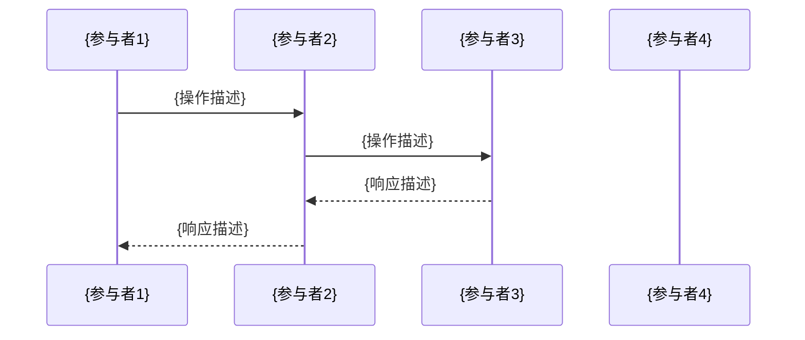
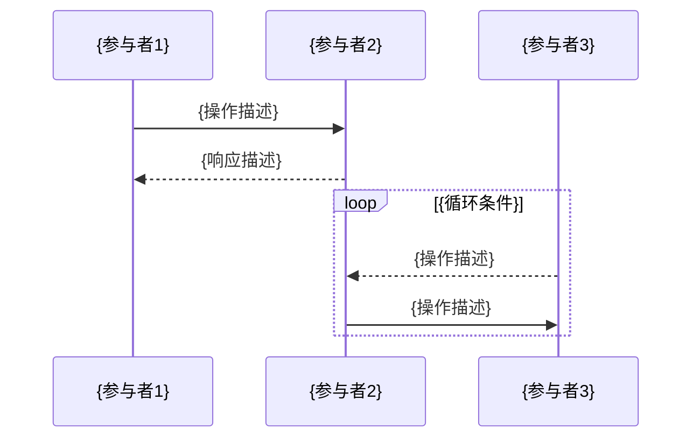

# {项目名称} - 技术实现方案

## 1. 方案概述

### 1.1 项目背景
根据 `spec.md` 要求，{简要描述项目背景和定位}。

### 1.2 项目目标
- {目标1：核心功能描述}
- {目标2：系统对接描述}
- {目标3：业务支持描述}
- {目标4：扩展性要求}

### 1.3 方案依据
本方案严格遵循 `constitution.md` 的开发宪法：
- 简单性原则：仅实现spec要求的功能，避免过度设计
- 测试先行：采用TDD方法进行开发
- 明确性原则：错误处理显式化，接口职责单一

## 2. 系统架构设计

### 2.1 技术栈选择
基于 `AGENTS.md` 的项目通用技术标准：
- **后端框架**: {选择合适的后端框架} ({选择理由，如：高性能，支持异步，API文档自动生成})
- **数据库**: {PostgreSQL/MySQL/MongoDB} ({选择理由})
- **缓存**: {Redis/Memcached} ({用途说明，如：状态存储、会话管理})
- **消息队列**: {Redis/RabbitMQ/Kafka} ({选择理由})
- **{特定技术}**: {库/工具名称} ({用途说明})
- **异步处理**: {根据所选语言的技术栈，如：asyncio + uvloop for Python, async/await for C#, etc.} ({用途说明})
- **{前端框架}**: {Vue.js 3/React/Angular} + {Tailwind CSS/Bootstrap/其他} ({如需要})
- **身份认证**: {HTTP Basic Authentication/JWT/OAuth2} ({选择理由})

### 2.2 模块化架构
按内部模块划分，确保职责分离：
- {模块1名称}模块
- {模块2名称}模块
- {模块3名称}模块
- {模块4名称}模块
- {模块5名称}模块

## 3. 数据库设计实施

### 3.1 数据库表创建
根据 `spec.md` 中的设计实现：

#### 3.1.1 {表名1} ({table_name_1})
```sql
CREATE TABLE {table_name_1} (
    id SERIAL PRIMARY KEY,
    {field_1} {TYPE} {CONSTRAINTS},           -- {字段说明}
    {field_2} {TYPE} DEFAULT {value},         -- {字段说明}
    created_at TIMESTAMP DEFAULT CURRENT_TIMESTAMP,
    updated_at TIMESTAMP DEFAULT CURRENT_TIMESTAMP
);
```

#### 3.1.2 {表名2} ({table_name_2})
```sql
CREATE TABLE {table_name_2} (
    id SERIAL PRIMARY KEY,
    {field_1} {TYPE} {CONSTRAINTS},           -- {字段说明}
    {field_2} {TYPE} DEFAULT {value},         -- {字段说明}
    created_at TIMESTAMP DEFAULT CURRENT_TIMESTAMP,
    updated_at TIMESTAMP DEFAULT CURRENT_TIMESTAMP,
    FOREIGN KEY ({foreign_key}) REFERENCES {parent_table}({parent_key})
);
```

## 4. API接口设计

### 4.1 {功能模块1}接口 (所属模块: {模块名称})

#### 4.1.1 {接口功能描述}
```
{HTTP_METHOD} /api/v1/{resource}/{action}
Content-Type: application/json

请求参数:
{
  "{param1}": "{value}",      // {参数说明}
  "{param2}": "{value}"       // {参数说明}
}

响应:
{
  "code": 0,
  "message": "success",
  "data": {
    "{field1}": {value},      // {字段说明}
    "{field2}": {value}       // {字段说明}
  }
}
```

### 4.2 {功能模块2}接口 (所属模块: {模块名称})

#### 4.2.1 {接口功能描述}
```
{HTTP_METHOD} /api/v1/{resource}/{id}

响应:
{
  "code": 0,
  "message": "success",
  "data": {
    "{field1}": {value},      // {字段说明}
    "{field2}": {value}       // {字段说明}
  }
}
```

### 4.3 系统通用接口 (所属模块: API服务)

#### 4.3.1 健康检查
```
GET /health

响应:
{
  "status": "healthy",
  "timestamp": "2023-12-01T10:00:00Z"
}
```

#### 4.3.2 获取系统信息
```
GET /info

响应:
{
  "version": "1.0.0",
  "uptime": "24h",
  "{metric_name}": {value}
}
```

## 5. 核心模块实现

### 5.1 {模块1名称} ({module_1_name})
- **职责**: {模块职责描述}
- **实现要点**:
  - {要点1：技术实现细节}
  - {要点2：关键功能描述}
  - {要点3：依赖关系说明}
  - {要点4：错误处理机制}

### 5.2 {模块2名称} ({module_2_name})
- **职责**: {模块职责描述}
- **实现要点**:
  - {要点1：技术实现细节}
  - {要点2：关键功能描述}
  - {要点3：状态管理机制}
  - {要点4：性能优化策略}

### 5.3 {模块3名称} ({module_3_name})
- **职责**: {模块职责描述}
- **实现要点**:
  - {要点1：业务逻辑实现}
  - {要点2：数据处理流程}
  - {要点3：事件通知机制}
  - {要点4：容错处理}

## 6. 核心业务流程实现

### 6.1 {业务流程1名称}
1. {步骤1描述}
2. {步骤2描述}
3. {步骤3描述}
4. {步骤4描述}
5. {步骤5描述}
6. {步骤6描述}
7. {步骤7描述}
8. {步骤8描述}
9. {步骤9描述：异常处理}

**时序图（{业务流程1名称}）**：


### 6.2 {业务流程2名称}
1. {步骤1描述}
2. {步骤2描述}
3. {步骤3描述}
4. {步骤4描述}

**时序图（{业务流程2名称}）**：


## 7. 测试策略

### 7.1 测试类型
- **单元测试**: 对核心组件进行隔离测试
- **集成测试**: 测试模块间交互
- **端到端测试**: 测试完整业务流程

### 7.2 测试优先级
严格遵循 `constitution.md` 的测试先行原则：
1. 首先为每个核心功能编写失败的测试
2. 实现最简代码让测试通过
3. 在测试保护下进行重构

### 7.3 测试实现
- 使用适合所选语言的测试框架进行测试（如：JUnit for Java, pytest for Python, Jest for JavaScript, etc.）
- 数据驱动测试方式覆盖正常路径、边界条件和错误情况
- 采用可控的fake/in-memory实现而非过度mock

## 8. 部署策略

### 8.1 部署架构
- 采用适合项目规模的架构模式（单体架构/Microservices/Serverless等）({选择理由})
- 模块化代码设计，便于维护和扩展
- 支持容器化部署 (如：Docker) 或传统部署方式
- 支持水平或垂直扩展 ({具体扩展方式})

### 8.2 配置管理
- 环境变量管理敏感配置
- 使用适合部署方式的服务编排工具（如：Docker Compose, Kubernetes YAML, Terraform等）定义服务依赖关系
- 环境隔离（开发、测试、生产）