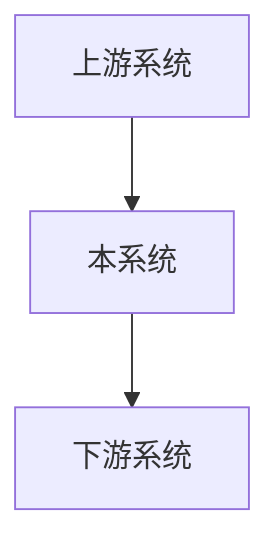

# [系统/功能名称] - 规格说明书

> **说明**: 本文档专注于描述业务需求和业务流程，不涉及技术实现细节。
>
> **原则**:
> - 回答"做什么"（What）和"为什么"（Why），而非"怎么做"（How）
> - 使用业务语言，便于技术和非技术人员理解
> - 保持简洁，控制在 2-3 页以内

---

## 1. 概述

### 1.1 文档目的
本文档用于定义 [系统/功能名称] 的需求规格，[简要描述系统的定位和作用]。

### 1.2 需求背景
[描述业务背景和发展趋势，说明为什么需要这个系统/功能]

#### 1.2.1 业务痛点
- **痛点1**: [描述具体问题]
- **痛点2**: [描述具体问题]
- **痛点3**: [描述具体问题]

#### 1.2.2 业务需求
- **需求1**: [描述具体需求]
- **需求2**: [描述具体需求]
- **需求3**: [描述具体需求]

#### 1.2.3 技术挑战
- **挑战1**: [描述技术挑战]
- **挑战2**: [描述技术挑战]

#### 1.2.4 系统架构概览
为了解决上述需求，[系统名称]采用以下架构：



[用一两句话说明架构的关键点]

### 1.3 系统目标
- [目标1]
- [目标2]
- [目标3]

### 1.4 系统边界
- **外部系统**: [列出与本系统交互的外部系统]
- **内部模块**:
  - 模块1: [模块职责]
  - 模块2: [模块职责]
  - 模块3: [模块职责]

---

## 2. 核心业务流程

### 2.1 [业务流程1名称]
1. [步骤1]
2. [步骤2]
3. [步骤3]
4. [异常情况处理]

### 2.2 [业务流程2名称]
1. [步骤1]
2. [步骤2]
3. [步骤3]
4. [异常情况处理]

---

## 使用说明

1. **创建新规格文档**:
   ```bash
   cp specs/spec-template.md specs/{编号}-{需求名称}/spec.md
   ```

2. **编写要点**:
   - 删除所有注释和说明文字
   - 专注于业务需求，不涉及技术实现
   - 保持简洁，2-3页即可

3. **后续步骤**:
   - 完成后使用 `/generate_plan` 生成技术方案（plan.md）
   - 再使用 `/generate_task` 生成任务清单（tasks.md）
